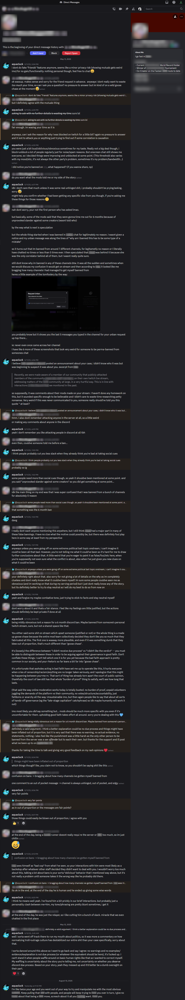
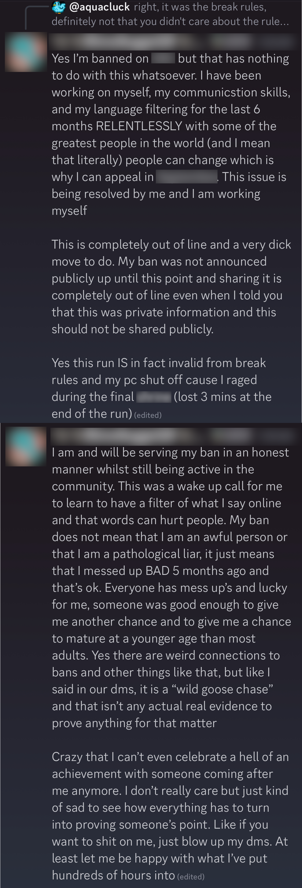

### Patient 3: Patrick Jordan
- Speedrunner who (after a series of unfortunate mistakes) decided to approach me (a community lurker), with a series of extraordinary accusations against multiple speedrunning organizations.

### May 2025:
Patrick Jordan, a self proclaimed world record holder and tournament winning gamer, contacted me out of the blue to ask why I had previously blocked him. I'm not a speedrunner or moderator or anyone particularly noteworthy, I just write code and shoot my mouth off. He had somehow noticed my silent filtering and approached me after receiving a series of other bans two months prior.

I explained how I may block people for any reason from any account or space I control. My house, my rules, under my circumstances. No shirt no shoes no service. This is the American way, and a cornerstone of property rights.

Although Patrick doesn't immediately object to *my rights*, in a moment he goes on to assert that others have no right to ban him from their personal chatrooms. That these decisions were illegitimate. He shows me a random ban as though this were a smoking gun aimed at Lady Liberty's neck.

I can definitely sympathize with being ousted unaware like this, and the circumstances (taken at face value) were concerning, so I continued to hear him out in good faith throughout this conversation, even as I felt obligated to point out that his story wasn't making much sense. You don't just get booted from administrative platforms for no apparent nor given reason, that's absurd, recordkeepers+verifiers+etc could never run a serious operation if they were pulling stunts like that all the time. It's an entirely different situation from an individual's chatroom.

I wasn't sure what to make of the story at this point, so I chose to leave the situation alone for several months. One or more of these parties had probably messed up, but I knew better than to jump to conclusions and start conflict, so I moved on while keeping an ear out. Lies told don't just go away, and if I found out that Patrick was manipulating me, I would take that very personally. Patrick didn't grasp this aspect of human nature and quickly moved on, ignorant to what he had just done to me.

Over the next couple months I repeatedly stumbled into statements that eroded my remaining confidence in Patrick. I encountered him trash talking the tournament prize he was about to win (taking a cheap partisan shot in the process and injecting American pop politics into a foreign streamer's audience), encountered him apparently calling classmates in his chatroom "diddy disciples", and finally, I heard an unsubstantiated public accusation that he was caught evading his leaderboard ban (like with an alternate account) from an unnamed+uninvolved source who I'm inclined to believe.

### August 2025:
From that point onwards, I've believed (but can't conclusively prove) that I've been wronged and manipulated in what appears to be Patrick's plot to disrupt the moderation team. Like I've explained above, I'm not inclined to criticize the actions of the mod team in their personal spaces, and the fact that the accused mods yielded the issue to an arbiter or relayer rather than keeping the issue between themselves also reflects well on them.

However, there are clearly areas they could be more transparent to protect themselves from claims made against them in bad faith. Onlookers shouldn't have to wonder what infractions+events transpired while malicious actors attempt to rewrite the truth. They *could* treat us like adults and show us the evidence for community-level bans, and in time I feel it's our responsibility to nudge more of moderation into this direction. Even after this treatment, I'm still going to bat for Patrick in some sense by acknowledging this. Other than vague appeals to "minimizing drama", I see no reason not to empower our leaders to demonstrate+affirm their credibility with supporting evidence. This topic has parallels to police body cams, where different nations+states record and expose varying degrees of footage: for public access, for prosecution, for internal affairs, etc.

But for now, in this specific case, I'm far more offended by the brazen attempt at manipulation by Patrick than I am over the imperfect transparency by mods. Foolish liars have been a known quantity for millenia, but distributed online moderation is a bit of a new frontier, and hiccups here are still to be expected.

So when he posted on the largest relevant community which had not yet banned him, to brag about his double-invalid coulda-woulda been record, I did not hesitate to point out the compounding self-inflicted stains on his achievement. Stains which he sought to hide from public view partially by abusing my good faith and benefit of the doubt to assure my silence. Below you will see his meltdown which followed, patting himself on the back for growing so very much over the course of the preceding events. A truly inspiring tale of self pity. In a fair world, everyone Patrick touched in this story would receive a proper apology for his (indeed) pathological lies. He messed up bad much more than once, and it's not okay.

### The accusations:

### The self-pitiful screeching fallout when his own accusations are made public:

